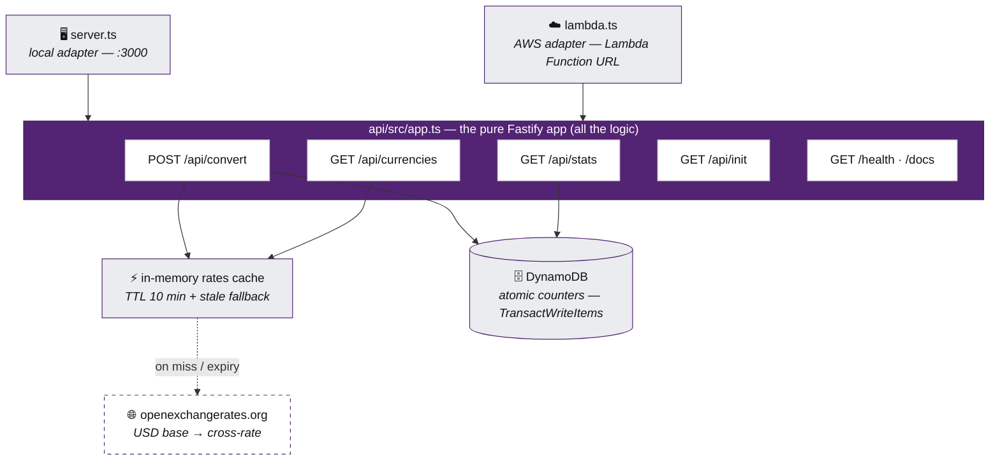

# Purple currency converter


[](https://github.com/01laky/purple-currency-converter/actions/workflows/ci.yml)

A currency conversion REST API with live exchange rates, an in-memory rates cache, persistent conversion statistics and infrastructure as code — a Purple LAB case study built in a tightly governed AI collaboration (see [AI collaboration](#ai-collaboration)).

## Future vision

_If AI writes the code, what does a great engineer actually do?_

When AI writes code, a great engineer can finally design the architecture they've always dreamed of, instead of spending 95% of their time writing code.

## How it works



Design notes and conscious trade-offs:

- **The rates cache** holds the openexchangerates payload in memory for 10 minutes. The theoretical maximum under continuous traffic (~4,320 fetches/month) exceeds the OER free-plan limit of 1,000/month — accepted: fetches happen exclusively on demand, real case-study traffic is sporadic, and exhausting the limit is absorbed by the stale fallback (an OER outage or limit serves the last good copy; `502 RATE_PROVIDER_ERROR` only when not even a stale copy exists). On Lambda the cache is per instance — the worst case is one extra fetch.
- **Every pair is a cross-rate through USD** (`rate(from→to) = usdRates[to] / usdRates[from]`) — the free plan serves no other base.
- **Money is rounded in exactly one place** (`roundMoney` — half-up to 2 decimal places, computed from the decimal string, never float multiplication) and the statistics aggregate in **integer EUR cents**, converted at write time with the rate valid at that moment.
- **The statistics are atomic counters, not an event log** — the assignment asks for three aggregates, not history; counters are O(1) to write and read. One `TransactWriteItems` updates the global and the per-target counter together, so they can never drift apart. The traded-away per-conversion history sits in the backlog.
- **Every SST stage owns its whole stack** including its DynamoDB table — dev conversions never pollute production statistics.

## API reference

**Live (production, one origin):** <https://d39k5qe4ticled.cloudfront.net> — **the app**, with the API same-origin under [`/api/*`](https://d39k5qe4ticled.cloudfront.net/api/stats), the diagnostics at [`/health`](https://d39k5qe4ticled.cloudfront.net/health) and the interactive [`/docs`](https://d39k5qe4ticled.cloudfront.net/docs)

Interactive documentation: **`GET /docs`** (Swagger UI, available in production too); the raw OpenAPI document at `/docs/json`; the committed contract artifact in [`api/openapi.json`](api/openapi.json).

### `POST /api/convert`

```jsonc
// request
{ "amount": 100, "from": "EUR", "to": "GBP" }
// 200
{ "amount": 100, "from": "EUR", "to": "GBP", "rate": 0.8612, "result": 86.12, "rateTimestamp": "2026-06-12T10:00:00.000Z" }
```

- `amount` — positive, at most 2 decimal places, at most 1e12; `from`/`to` — 3-letter codes, case-insensitive (normalized to uppercase), must differ.
- `rate` is returned in **full precision** (it is not a monetary amount — it makes the math verifiable); `result` is the only rounded field. Known limit: near the 1e12 amount bound converted into a very-high-rate currency, the result exceeds what IEEE doubles represent to the cent — documented in the proposal Backlog.
- **`rateTimestamp` is the time the rates were fetched from the provider, NOT the moment of the conversion** — under the stale fallback it honestly carries the older time.
- **Rate limited: 60 requests per minute per client IP** (only this endpoint — it is the one that writes). Over the limit → `429 RATE_LIMITED` in the unified error shape. Honest scope: the counter lives in instance memory, so with N concurrent Lambda instances the effective ceiling is N×60 (the account concurrency cap of 10 is the hard backstop), and the limit is **abuse damping, not a security boundary** — the keying trusts the IP CloudFront appends to `x-forwarded-for`, which a caller hitting the Lambda Function URL directly can spoof; the public entry point is the CloudFront URL.

### `GET /api/currencies`

```jsonc
{ "currencies": { "EUR": "Euro", "GBP": "British Pound Sterling" /* … */ } }
```

The **intersection** of the OER currency names and the cached rates — only currencies that actually have a rate are listed, so the list never diverges from what `/api/convert` accepts. Carries `Cache-Control: public, max-age=3600`.

### `GET /api/stats`

```jsonc
{ "totalConversions": 42, "totalAmountEur": 12345.67, "topTargetCurrency": "EUR" }
```

Persistent across restarts and clients (DynamoDB). `topTargetCurrency` resolves ties to the alphabetically first code and is `null` before the first conversion. Never cached — always fresh.

### `GET /api/init`

All texts of the system (EN/CS/SK) in one response: `{ "languages": ["en", "cs", "sk"], "translations": { … } }`. Carries a strong `ETag` + `Cache-Control: no-cache`; a request with a matching `If-None-Match` gets `304 Not Modified` with an empty body.

### `GET /health`

```jsonc
{ "ok": true, "version": "1.0.0", "uptime": 1234, "ratesCacheAge": 120 }
```

Instance diagnostics — the version, the process uptime and the age of the rates cache (`null` before the first fetch).

### The error model

Every error has the unified shape `{ "error": { "code", "key", "message", "params"? } }` — `code` for programmatic handling, `key` as the i18n key translatable via `/api/init`, `message` always in English.

| HTTP | `code`                 | When                                                       |
| ---- | ---------------------- | ---------------------------------------------------------- |
| 400  | `VALIDATION_ERROR`     | an input shape error — the `key` names the exact reason    |
| 404  | `NOT_FOUND`            | an unknown route                                           |
| 422  | `UNSUPPORTED_CURRENCY` | the currency has no rate (`params.code` carries which one) |
| 429  | `RATE_LIMITED`         | over 60 `/api/convert` requests per minute from one IP     |
| 500  | `INTERNAL_ERROR`       | unexpected — no stack traces, no internals in the response |
| 502  | `RATE_PROVIDER_ERROR`  | the rate provider is unreachable and no stale copy exists  |

## Quick Start

### Local

Prerequisites: Node 22 (`nvm use` picks it up from `.nvmrc`), Docker (for dynamodb-local), a free [openexchangerates.org](https://openexchangerates.org) App ID.

```bash
nvm use
cd api
npm install
npm run setup            # starts dynamodb-local (:8002), creates the table, copies .env
# put your App ID into api/.env:  OER_API_KEY=<app id>
npm run dev              # the API on http://localhost:3000  (Swagger at /docs)
npm run verify:api       # typecheck + lint + tests
```

And the frontend (the API must be running):

```bash
cd web
npm install
cp .env.example .env     # VITE_API_URL=http://localhost:3000
npm run dev              # the app on http://localhost:5173
npm run verify:web       # typecheck + lint + tests
npm run generate:api     # regenerate the client after an api contract change
```

### AWS

```bash
cd deploy && npm install
npx sst secret set OerApiKey <app id> --stage production
npx sst deploy --stage production    # prints the live Function URL
```

### Environment variables

The complete list lives in [`api/.env.example`](api/.env.example):

| Variable          | Role                                                        | Local value                 |
| ----------------- | ----------------------------------------------------------- | --------------------------- |
| `PORT`            | the local server port                                       | `3000` (default)            |
| `DYNAMO_ENDPOINT` | the dynamodb-local endpoint; unset/empty = the AWS mode     | `http://localhost:8002`     |
| `STATS_TABLE`     | the statistics table name                                   | `ConversionStats` (default) |
| `OER_API_KEY`     | the openexchangerates App ID (a secret — SST secret on AWS) | — (required)                |
| `FRONTEND_ORIGIN` | the exact CORS origin for the local web dev (never `*`; production is same-origin, no CORS) | `http://localhost:5173` (default) |

The frontend has its own [`web/.env.example`](web/.env.example): `VITE_API_URL` — the API base for the local dev; EMPTY in the production build (same-origin relative calls through the Router, v0.10.0).

## Documentation

| Document                             | Content                                          |
| ------------------------------------ | ------------------------------------------------ |
| [docs/proposal.md](docs/proposal.md) | the binding design and the roadmap 0.0.0 → 1.0.0 |
| [docs/AI_SETUP.md](docs/AI_SETUP.md) | the AI collaboration process and its reasoning   |

## Project Status

**v1.0.0 — the submission is complete: Level 1 + Level 2 + both bonuses (deploy, IaC), live in production.**

| Version      | Content                                             | Status |
| ------------ | --------------------------------------------------- | ------ |
| 0.0.0        | the AI process and the working rules                | ✅     |
| 0.1.0        | the project skeleton, the error model, CI           | ✅     |
| 0.2.0        | i18n and `GET /api/init`                            | ✅     |
| 0.3.0        | the rate provider (cache, stale fallback)           | ✅     |
| 0.4.0        | `GET /api/currencies`                               | ✅     |
| 0.5.0        | `POST /api/convert` and the money discipline        | ✅     |
| 0.6.0        | the DynamoDB statistics and `GET /api/stats`        | ✅     |
| 0.7.0        | SST v4 (IaC) and the Lambda adapter                 | ✅     |
| 0.8.0        | the production deploy and the live URL              | ✅     |
| 0.9.0        | the frontend base — the monorepo, the Figma tokens, the generated client, the converter | ✅ |
| 0.10.0       | the frontend completion + the same-origin deploy (Level 2) | ✅ |
| 0.11.0       | hardening (the rate limit, the adversarial pass, the documentation sync) | ✅ |
| 1.0.0        | the submission (the future vision, the time budget) | ✅     |

## Tech Stack

TypeScript (strict — no `any`, no type assertions) · Fastify 5 + Zod 4 (`fastify-type-provider-zod` — one schema source for validation, types and OpenAPI) · DynamoDB · SST v4 (AWS Lambda, IaC) · React 19 + Vite (SCSS Modules, the design tokens from the committed Figma export) · orval (the API client GENERATED from `openapi.json` — the backend and the frontend share no code) · Vitest + React Testing Library.

## AI collaboration

This project is also an experiment in governed AI collaboration: every version starts as a reviewed prompt (`prompt/`), the AI implements against 29 committed working rules ([CLAUDE.md](CLAUDE.md)) with machine-enforced guardrails (`.claude/settings.json` — the AI cannot push, deploy or read secrets), and every meaningful moment — including failures and corrections in both directions — is recorded as it happens in **[AI_DIARY.md](AI_DIARY.md)**.

### Time budget

Summed from the datetimed CHANGELOG.md and AI_DIARY.md records collected since day one (rules 14/26 — no retroactive reconstruction; a gap over 60 minutes splits work blocks), plus the proposal writing that preceded the first recorded session:

| Work block                | Range               | Duration       | Covers                            |
| ------------------------- | ------------------- | -------------- | --------------------------------- |
| The proposal              | before the records  | 3 h 00 min     | docs/proposal.md — the design and the roadmap |
| Session 1                 | 04:15 – 05:58       | 1 h 43 min     | v0.0.0 → v0.3.0                   |
| Session 2                 | around 11:03        | 1 h 10 min     | v0.4.0                            |
| Session 3                 | 12:10 – 17:02       | 4 h 52 min     | v0.5.0 → v0.11.0                  |
| Session 4                 | 17:15 – 17:30       | 0 h 15 min     | v1.0.0 — the submission           |
| **Total**                 |                     | **≈ 11 h 00 min** |                                |

## Author

**Ladislav Kostolný**
